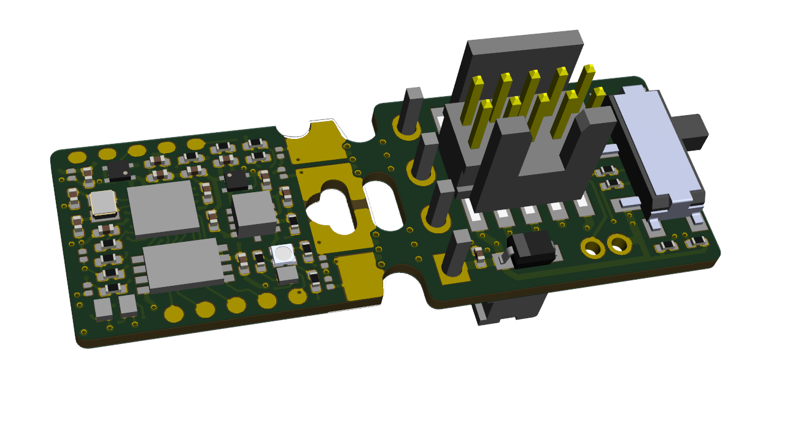
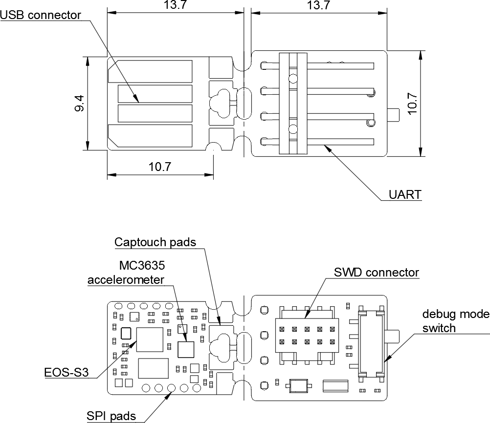

======================
Qomu Development Board
======================

Overview
========

This repository contains open hardware design files for a development board based on the Quicklogic `EOS S3 Sensor Processing Platform <https://www.quicklogic.com/products/eos-s3/>`_.
The design files were created by `Antmicro <https://www.antmicro.com>`_ in cooperation with `Quicklogic <https://www.quicklogic.com/>`_.
The board is small enough to fit into a USB socket.
This allows the user to explore functionalities of the EOS S3 platform on the go without cables or taking up space on your desk.
The board has an additional break-away part with debug connectors that speed up initial bringup and software development.

Key features
============

* EOS S3 Sensor Processing Platform
* 16Mbit of external flash memory
* Accelerometer
* User RGB LED
* Capacitive touch pads
* Supplied with 5.0VDC from USB port
* USB data signals tied to programmable logic

Layout and dimensions
=====================

